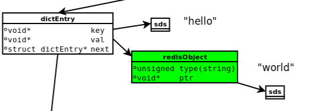

# redis内存模型

###  Redis内存划分

#### 1. 数据

Redis存储的数据, 其中包括String, list, map, set, sortedset

#### 2. 进程本身运行需要的内存

Redis主进程运行的内存. 此外, redis创建的子进程也会占用内存, 如Redis执行的AOF, RDB重写时创建的子进程.

#### 3. 缓冲内存

缓冲内存包括:

客户端缓冲区: 客户端缓冲存储客户端连接的IObuffer

复制积压缓冲区: 部分复制功能

AOF缓冲区: 用于在进行AOF重写的时候, 保存最近写入的命令

#### 4. 内存碎片

内存碎片是Redis在分配, 回收物理内存过程中产生的. 

### 存储数据模型

#### 概述

Redis是一个Key-Value数据库. 因此, 每一个键值都有一个dicEntry, 里面存储了一个指向Key和Value的指针, 同时还保留了一个指向下一个dicEntry的next指针. 此外, Key主要是存储在SDS结构中, value则是指向一个redisObject, 表示redis的值. 而redisObject的type字段指明了value对象的类型, ptr则指向一个sds结构中.

存储模型大致如下:



#### 1. redisObject

redisObject的定义如下:

```c
typedef struct redisObject{
  unsigned type:4;
  unsigned encoding:4;
  unsigned lru:REDIS_LRU_BITS;
  int refcount;
  void *ptr;
} robj;
```

##### type

type表示对象类型: REDIS_STRING, REDIS_LIST, REDIS_HASH, REDIS_SET, REDIS_ZSET

```c
//type的占5种类型：
/* Object types */
#define OBJ_STRING 0    //字符串对象
#define OBJ_LIST 1      //列表对象
#define OBJ_SET 2       //集合对象
#define OBJ_ZSET 3      //有序集合对象
#define OBJ_HASH 4      //哈希对象
```

##### encoding

encoding的类型, 如下

```cpp
/* Objects encoding. Some kind of objects like Strings and Hashes can be
 * internally represented in multiple ways. The 'encoding' field of the object
 * is set to one of this fields for this object. */
// encoding 的10种类型
/* Raw representation */ //原始表示方式，字符串对象是简单动态字符串
#define OBJ_ENCODING_RAW 0
/* Encoded as integer */         //long类型的整数
#define OBJ_ENCODING_INT 1
/* Encoded as hash table */      //字典
#define OBJ_ENCODING_HT 2
/* Encoded as zipmap */          //不在使用
#define OBJ_ENCODING_ZIPMAP 3
/* Encoded as regular linked list */  //双端链表,不在使用
#define OBJ_ENCODING_LINKEDLIST 4
/* Encoded as ziplist */         //压缩列表
#define OBJ_ENCODING_ZIPLIST 5
/* Encoded as intset */          //整数集合
#define OBJ_ENCODING_INTSET 6
/* Encoded as skiplist */      //跳跃表和字典
#define OBJ_ENCODING_SKIPLIST 7
/* Embedded sds string encoding */ //embstr编码的简单动态字符串
#define OBJ_ENCODING_EMBSTR 8
 /* Encoded as linked list of ziplists */ //由压缩列表组成的双向列表-->快速列表
#define OBJ_ENCODING_QUICKLIST 9
```

通过encoding属性, redis可以根据不同的使用场景来为对象设置不同的编码, 大大提高了redis的灵活性和效率. 比如, 列表有压缩列表(`OBJ_ENCODING_ZIPLIST`)和快速列表`OBJ_ENCODING_QUICKLIST`两种方式. 如果列表中的元素较少, 使用压缩链表将会占用内存更少, 而且比双端链表可以更快载入; 如果列表中的元素较多, 则会使用快速列表`OBJ_ENCODING_QUICKLIST`.

##### LRU

lru记录的是对象最后一次被程序访问的时间. 通过对比LRU时间与当前时间, 可以计算某个对象的空转时间. `object idletime`可以显示该空转时间. `redis`会优先空转时间最长的对象释放.

##### recount

recountk记录的是该对象被引用的次数, 类型为整形. 该对象主要用于对象的引用计数和内存回收.

###### 共享对象

Redis的共享对象, 目前只支持整数值得字符串对像. 目前而言, redis服务器在初始化时, 会创建1000个字符串对象, 值分别为0-9999的整数值; 如果需要使用值为0-9999的字符串对象是, 可以直接使用这些对象.

##### ptr

ptr指针指向具体数据.

一个redisObject对象的大小为16字节

### SDS(Simple Dynamic String)

#### SDS结构

```c
struct sdshdr{
  int len;
  int free;
  char buf[];
};
```


