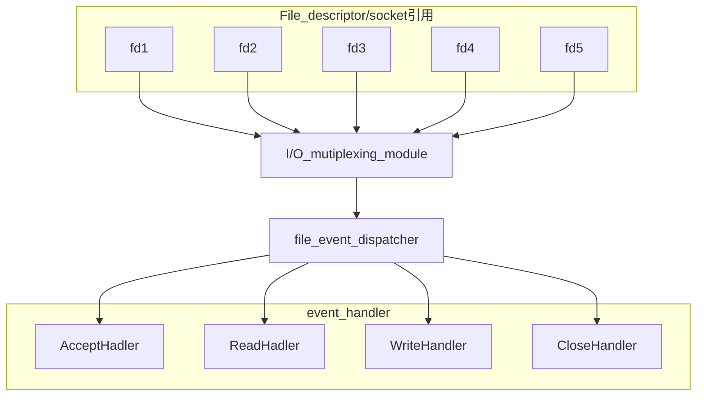
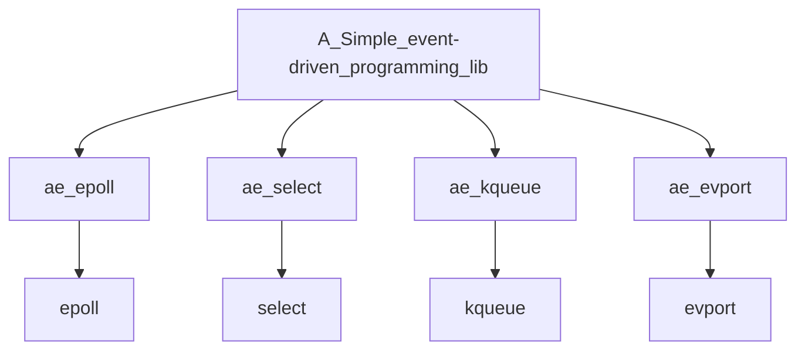
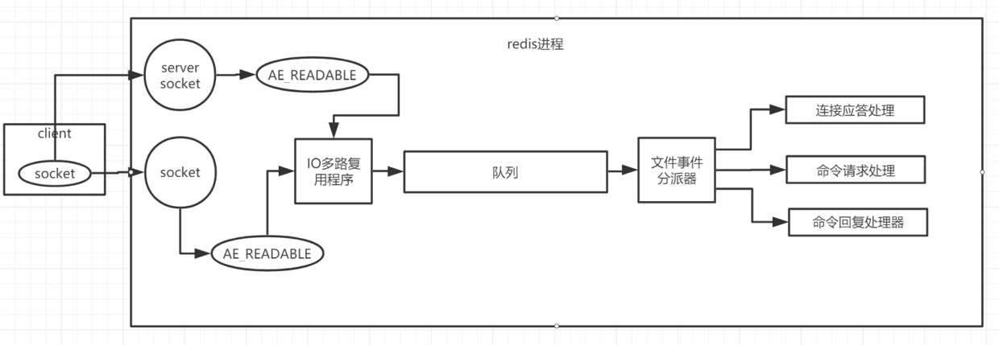
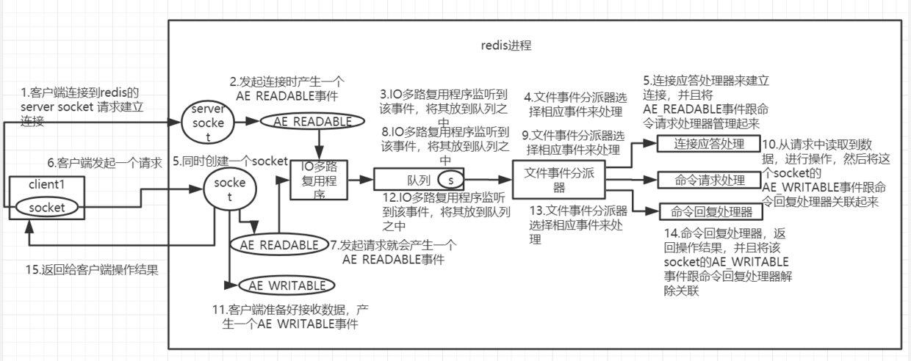
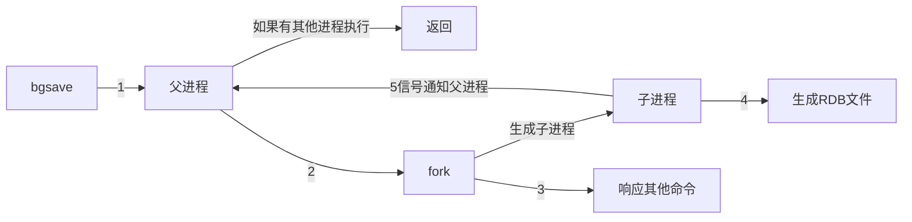
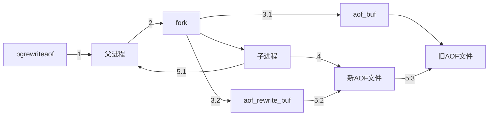

# redis基础学习

## 1. 线程模型

redis是基于reactor模式开发的网络事件处理器, 这个处理器是单线程的. 因此. Redis才被称为是单线程模式的. 

### Reactor设计模式



### 文件事件处理器

文件事件处理器使用多路IO复用模块, 同时监听多个FD(file descriptor, 文件描述符). 当发生aceept, read, write, close文件事件时, 文件事件处理器就会回调fd绑定的事件处理器.

### I/O多路复用模块

IO多路复用模块主要封装了底层的`select`, `epoll`, `avport`和`kqueue`这些多路复用函数, 为上层体统了相同的接口



详细介绍可以参阅`epoll分析.md`

Redis进程处理基本结构



Redis进程处理主要流程




### redis为什么可以支持高并发?

1. 纯内存操作
2. 基于非阻塞的IO多路复用机制
3. 单线程避免不必要的多线程上下文切换的开销

### memcached与reids的区别

1. Redis支持服务器端的数据操作,而memcached不能

   在memcahed中, 如果需要修改数据, 必须要将数据取到client, 然后修改,再发送回到server. 这样会造成很大的IO次数和数据体积的浪费.

2. redis数据结构更多, 并支持丰富的数据操作

3. 内存使用率高, 因为Redis采用组合式压缩

4. 性能: redis是单核的,而memcached是多核的, 存小数据时 Redis优于memcached, 大数据时memcached优于redis

5. 集群: redis天然支持集群, 而memcached不原生支持

### redis五大数据类

#### 1. String类型

只能set和get, 做简单的缓存

#### 2. hash

这个是类似map的一种,  这个一般是可以结构化的数据. 

```json
key=150, value={"id":150, "name":"zhangshang", "age":21}
```

#### 3.list

有序列表

适用场景

1. 微博某大v的粉丝
2. 文章评论列表
3. 通过Irang, 就是从某个元素开始读取多少个元素, 可以基于list实现分页查询.
4. 消息队列

#### 4. set

无序集合, 自动去重

适用场景

1. 分布式全局去重
2. 交并集(重复的就是并集)

#### 5.sorted set

有序集合, 自动去重

适用场景

1. 排行榜

## 2. redis过期策略

由于内存是有限的, 因此不可能放过多的数据. 因此, 需要过期策略来淘汰一些数据, 从而腾出空间.

### 过期策略

#### 1. 定期删除

##### 原理

redis每隔100ms就随机抽取一些设置了过期时间的key, 检查这些key是否过期.

1. 选择部分的原因在于: 重新检查全部缓存, 对于cpu的负载会很高

问题: 会出现大量已经过期的key没有被删除

#### 惰性删除

##### 原理

当client请求某个key的时候, redis会先去检测一下这个key是否过期, 如果已经过期了, 那么redis将会删除这个key.

### 内存淘汰机制

1. noeviction: 当内存不足以容纳新写的数据时, 新写入操作会报错, 从而无法写入新数据`不推荐`
2. allkeys-lru: 当内存不足以容纳新写数据时, 在key空间中, 移除一个最近最少使用的key`常用`
3. allkeys-random: 当内存不足时, 在key空间, 随机移除key `不推荐`
4. volatile-lru: 当内存不足时, 在设置过期时间的key空间中, 移除最少使用的key`不推荐`
5. volatile-random: 当内存不足时, 在设置过期时间的key空间中, 随机移除key
6. volatile-ttl: 当内存不足时, 在设置过期时间的key空间中, 移除有更早过期时间的key

### LRU算法的实现

```java
public class LRUCache<K, V> extends LinkedHashMap<K, V>{
  private final int CACHE_SIZE;
  
  //保存传递过来的最大数据量
  public LRUCahe(int cacheSize){
    super((int)Math.ceil(cacheSize/0.75)+1, 0.75f, true);
    CACHE_SIZE = CacheSize;
  }
  
  @Override
  protected boolean removeEldestEntry(Map.Entry eldest){
    return size()>CACHE_SIZE;
  }
}
```

## 3. Redis持久化

### Redis持久化策略

#### RDB持久化策略(冷备份)

##### 持久化原理

`RDB`: 快照的形式是直接把内存中的数据保存到一个dump文件中, 定时保存.

##### 手动触发

`save`命令: 阻塞Redis服务进程, 直到RDB文件创建完成为止.`save`可以通过设置多个保存条件, 只要一个条件满足, 即可在后台执行`save`. 

`bgsave`命令: fork()一个子进程, 由子进程来创建一个`RDB`文件, 父子进程共享数据段, 父进程继续提供读写服务, 而子进程实现备份功能. BGSAVE阶段只有在需要修改共享数据的时候才会进行拷贝(即copy-on-write). 当生成完成`RDB`文件后, 子进程将会通知父进程表示完成.

##### 自动触发

```bash
# 900秒内, 如果超过1个key被修改,则发起快照保存
save 900 1 
```

在默认情况下, 是快照`RDB`持久化方式. 当然可以`save`(手动执行)或者`bgsave`(异步)做快照.

执行流程如下图所示:




#### AOF(Append Only File)持久化策略(热备份)

##### 持久化原理

`AOF`: 把所有的对Redis的服务器进行修改的命令都存到一个文件里面, 命令的集合.

##### 实现原理

`append-->write-->fsync`

`append`: 将Redis的写命令追加到aof_buf, 主要是避免每次有写命令就直接写到磁盘, 导致磁盘`IO`成为Redis的负载瓶颈.

 `write`和`fsync`: 根据不同的同步策略将aof_buf的内容同步到磁盘. 当用户调用`write()`函数的时候, 现代操作系统通常会将数据暂存到一个内存缓冲区中. 当缓冲区被填满或超过指定时限的时, 才真正将缓冲区的数据写入到磁盘中. 但是如果计算机停机, 缓冲区的数据建辉丢失. 因此, redis提供了fsync, fdatasync等同步函数, 可以强制操作系统将缓冲区的数据写入到磁盘.

> AOF同步策略详解:
>
> `always`: 命令写入到aof_buf后立即调用系统fsync同步到aof文件, fsync完成线程返回.
>
> `no`:命令写入到aof_buf后调用`write`, 不对AOF文件做`fsync`同步; 同步由操作系统负责, 通常同步周期为30秒
>
> `everysec`:命令写入到aof_buf后调用系统`write`操作,  `write`完成后线程返回; `fsync`操作由专门线程每秒调用一次.

##### 重写

 `rewrite` : 定期重写AOF文件, 达到压缩的命令. 注意, AOF重写是把Redis进程内的数据转化为写命令, 同步到新的AOF文件; 不会对旧的文件进行任何读取和写入操作.

>重写能压缩`AOF`文件的主要原因在于:
>
>1. 过期的数据不再写入文件
>
>2. 无效的命令不再写入文件
>3. 多条命令可以合并为一条

触发:

`主动触发`: 直接调用`bgrewriteaof`命令, `fork`子进程进行具体的工作, 只有在`fork`时阻塞

`自动触发`: 根据`auto-aof-rewrite-min-size`和`auto-aof-rewrite-percentage`参数, `aof-current-size`和`aof_base_size`确定触发时机

AOF可以做到全程持久化, Redis每至执行一个修改数据的命令, 都会把他添加到`AOF`文件中. 当Redis重启时, 这将会读取AOF进行`重放`以恢复关闭前的最后时刻.

##### 配置

```bash
appendfsync yes
appendfsync always # 每次有数据修改发生时都会写入到AOF文件中
appendfsync everysec #每秒钟同步一次, 缺省策略
```

AOF的默认策略是每秒钟一次`fsync`, 在这样的配置下最多也只会丢失一秒钟的数据.

AOF文件重写流程:



>1 . Redis 父进程首先判断当前是否正在执行`bgsave`/`bgrewriteaof`进程. 如果存在`bgrewriteaof`命令, 则直接返回; 如果执行`bgsave`命令, 则等`bgsave`命令执行完成后再执行.
>
>2. 父进程创建子进程, 这个过程中父进程是阻塞的
>
>3. >1 fork后, `bgrewriteaof`命令返回 "background append only file rewrite started"信息, 并不再阻塞父进程, 并可以响应其他命令. Redis的所有写命令依然写入到`AOF`缓冲区, 并根据`appendsfsync`同步策略同步到硬盘.
>   >
>   >2 由于fork操作使用cow(copy on write)技术, 子进程只能共享fork操作时的内存数据. 另一方面, 父进程仍然在响应命令, 因此Redis使用aof_rewrite_buf来保存这部分数据, 防止新AOF文件生成期间丢失这一部分数据. 换而言之, reids写命令同时追加到aof_buf和aof_rewrite_buf
>
>4. 子程序根据内存快照, 按照命令合并规则写入到新的AOF文件中
>
>5. > 子进程写完新的AOF文件后, 向父进程发信号, 父进程更新统计信息
>   >
>   > 父进程把aof_rewrite_buf数据写入到新的AOF中
>   >
>   > 使用新的AOF文件替换老的AOF文件

### CPU阻塞问题

在Redis中, `bgsave`和`bgrewriteaof`都需要`fork`出子进程来进行操作. 如果Redis内存过大, 会导致fork时, 复制内存页表的耗时过多; 另一方面, `redis`主进程进行`fork`时, 是完全阻塞的, 这意味着无法响应客户端的请求.

对于不同的硬件, 不同的操作系统, fork的耗时会有所差别. 例如, 如果`redis`单机内存达到了10GB, fork耗时可能会达到百毫秒级别(如果是Xen虚拟机, 这个耗时将达到秒级别). 因此, 为了减轻fork操作带来的阻塞问题, 除了控制`redis`单机内存大小外, 还可以适当放宽AOF重写的触发条件.

### AOF阻塞问题

在AOF中, 如果AOF缓冲区的文件同步策略为everysec, 则: 在主线程中, 命令写入aof_buf后使用系统调用`write()`, `write`完成后主线程返回; fsync同步文件操作由专门的文件同步线程每秒调用一次. 但是, 如果磁盘负载过高, 以至于fsync操作无法在1s内完成. 如果Redis主线程持续高速向aof_buf写命令, 磁盘的负载可能会越来越大, IO资源消耗更快. 

而Redis的处理策略是这样的: 主线程每次进行aof会对比上次fsync成功的事件. 如果时间差小于2s, 主线程直接返回; 如果超过2s, 则主线程阻塞, 直到fsync同步完成. 这样会导致一个这样的问题: 如果磁盘io太慢了, redis主进程将会阻塞. 

#### AOF与RDB对比

|      | 优点         | 缺点               |
| ---- | ------------ | ------------------ |
| RDB  | 文件体积小   | 会有丢失数据的风险 |
| AOF  | 丢失数据很少 | 文件体积更大       |


