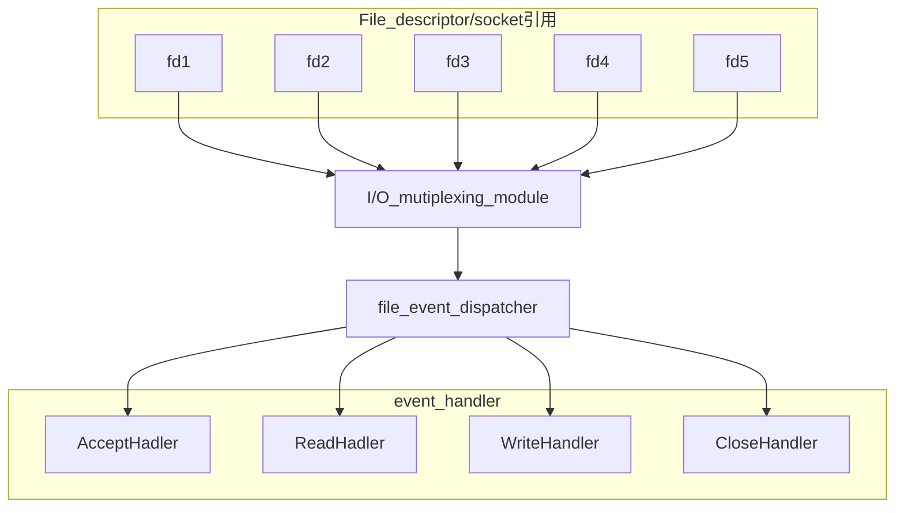
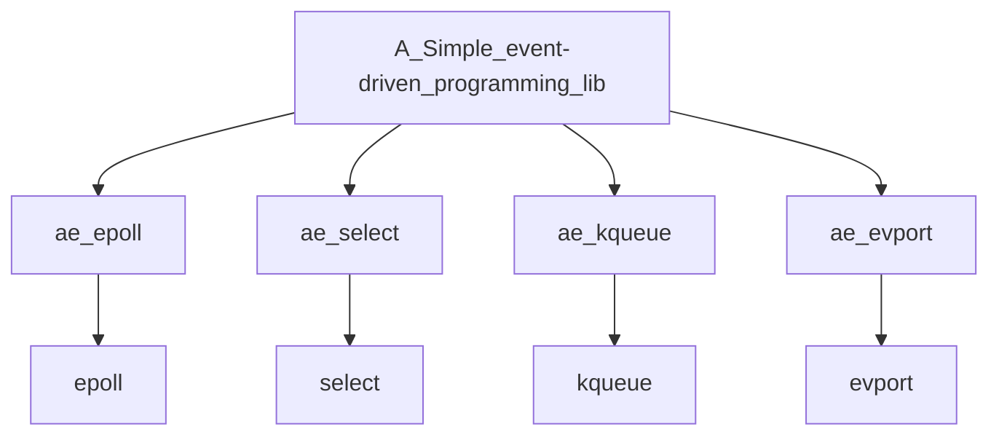

# redis基础学习

## 主要概念

redis是基于reactor模式开发的网络事件处理器, 这个处理器是单线程的. 因此. Redis才被称为是单线程模式的. 

### Reactor设计模式



### 文件事件处理器

文件事件处理器使用多路IO复用模块, 同时监听多个FD(file descriptor, 文件描述符). 当发生aceept, read, write, close文件事件时, 文件事件处理器就会回调fd绑定的事件处理器.

### I/O多路复用模块

IO多路复用模块主要封装了底层的`select`, `epoll`, `avport`和`kqueue`这些多路复用函数, 为上层体统了相同的接口



详细介绍可以参阅`epoll分析.md`

Redis进程处理基本结构


Redis进程处理主要流程


### redis为什么可以支持高并发?

1. 纯内存操作
2. 基于非阻塞的IO多路复用机制
3. 单线程避免不必要的多线程上下文切换的开销

### memcached与reids的区别

1. Redis支持服务器端的数据操作,而memcached不能

   在memcahed中, 如果需要修改数据, 必须要将数据取到client, 然后修改,再发送回到server. 这样会造成很大的IO次数和数据体积的浪费.

2. redis数据结构更多, 并支持丰富的数据操作

3. 内存使用率高, 因为Redis采用组合式压缩

4. 性能: redis是单核的,而memcached是多核的, 存小数据时 Redis优于memcached, 大数据时memcached优于redis

5. 集群: redis天然支持集群, 而memcached不原生支持

### redis五大数据类

#### 1. String类型

只能set和get, 做简单的缓存

#### 2. hash

这个是类似map的一种,  这个一般是可以结构化的数据. 

```json
key=150, value={"id":150, "name":"zhangshang", "age":21}
```

#### 3.list

有序列表

适用场景

1. 微博某大v的粉丝
2. 文章评论列表
3. 通过Irang, 就是从某个元素开始读取多少个元素, 可以基于list实现分页查询.
4. 消息队列

#### 4. set

无序集合, 自动去重

适用场景

1. 分布式全局去重
2. 交并集(重复的就是并集)

#### 5.sorted set

有序集合, 自动去重

适用场景

1. 排行榜

## redis过期策略以及内存淘汰机制

由于内存是有限的, 因此不可能放过多的数据. 因此, 需要过期策略来淘汰一些数据, 从而腾出空间.

### 过期策略

#### 1. 定期删除

##### 原理

redis每隔100ms就随机抽取一些设置了过期时间的key, 检查这些key是否过期.

1. 选择部分的原因在于: 重新检查全部缓存, 对于cpu的负载会很高

问题: 会出现大量已经过期的key没有被删除

#### 惰性删除

##### 原理

当client请求某个key的时候, redis会先去检测一下这个key是否过期, 如果已经过期了, 那么redis将会删除这个key.

### 内存淘汰机制

1. noeviction: 当内存不足以容纳新写的数据时, 新写入操作会报错, 从而无法写入新数据`不推荐`
2. allkeys-lru: 当内存不足以容纳新写数据时, 在key空间中, 移除一个最近最少使用的key`常用`
3. allkeys-random: 当内存不足时, 在key空间, 随机移除key `不推荐`
4. volatile-lru: 当内存不足时, 在设置过期时间的key空间中, 移除最少使用的key`不推荐`
5. volatile-random: 当内存不足时, 在设置过期时间的key空间中, 随机移除key
6. volatile-ttl: 当内存不足时, 在设置过期时间的key空间中, 移除有更早过期时间的key

### LRU算法的实现

```java
public class LRUCache<K, V> extends LinkedHashMap<K, V>{
  private final int CACHE_SIZE;
  
  //保存传递过来的最大数据量
  public LRUCahe(int cacheSize){
    super((int)Math.ceil(cacheSize/0.75)+1, 0.75f, true);
    CACHE_SIZE = CacheSize;
  }
  
  @Override
  protected boolean removeEldestEntry(Map.Entry eldest){
    return size()>CACHE_SIZE;
  }
}
```


