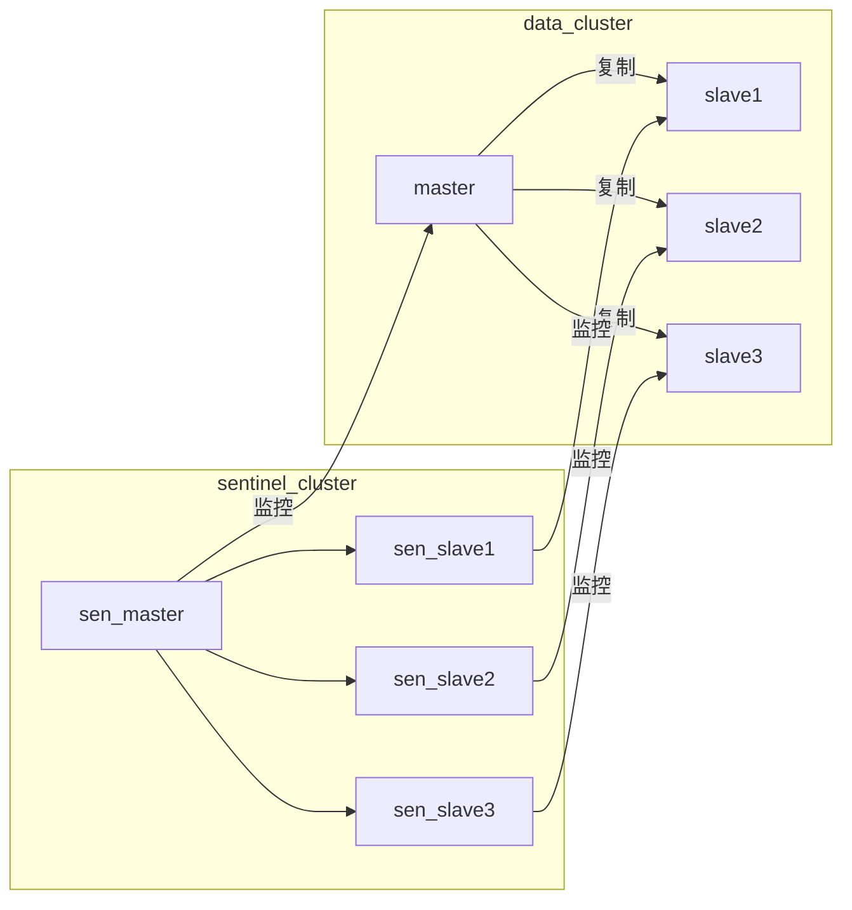
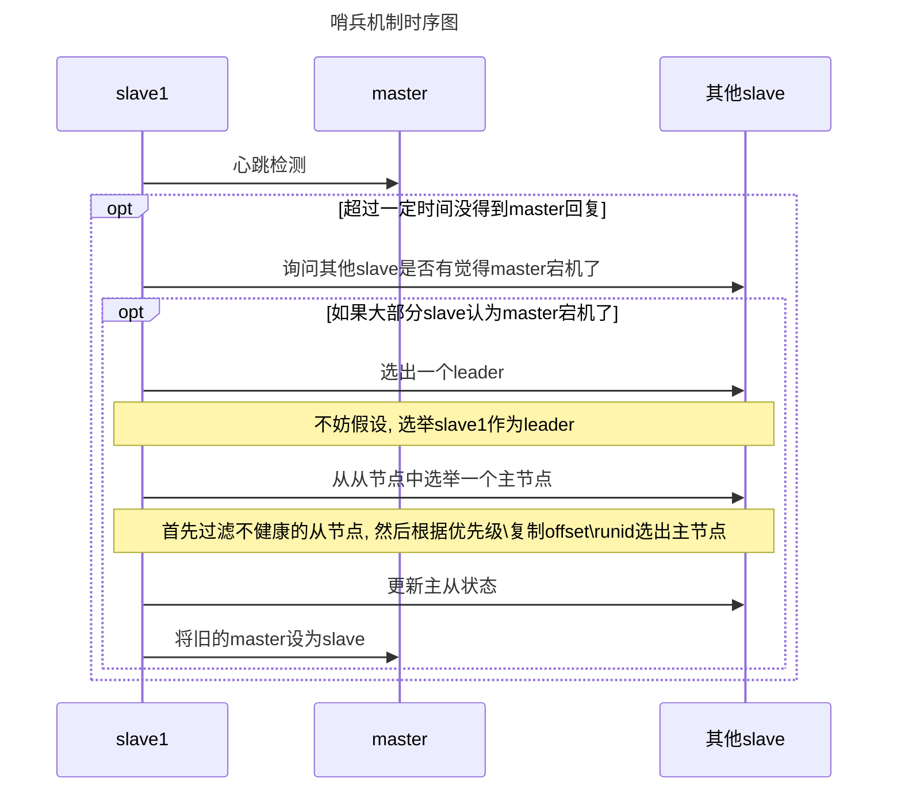

# Redis高可用

## 基本实现技术

##### 1. 持久化

 主要作用是做数据备份, 即将数据写入磁盘, 保证数据不会因为进程的退出而丢失.

##### 2. 复制

复制是实现高可用的基础, 哨兵和集群都是复制基础上实现高可用的. 复制主要实现了数据的多机备份, 以及读操作的负载均衡和简单的故障恢复. 但是, 这存在一些问题: 1. 故障恢复无法自动化; 2 写操作无法负载均衡; 3 存储能力受到单机限制.

##### 3. 哨兵机制

在复制的基础上, 哨兵机制实现了自动化的故障恢复. 但是无法做到: 1. 写操作的负载均衡; 2 存储能力受到单机限制.

##### 4. 集群

通过集群, Redis可以解决写操作的负载均衡, 以及存储能力受到单机限制的问题, 实现了较为完善的高可用方案. 

## 哨兵机制

### 概述

哨兵的核心功能是主节点的自动故障转移, 即保证每个redis都有备份, 当某个redis发生故障时, 可用很快地切换到备份redis上面去. 主要功能有:

1. 监控: 哨兵会不断地检查主节点和从节点是否正常运行
2. 自动故障转移:  当主节点无法正常工作时, 哨兵会开始自动故障转移操作, 他将失效的主节点的一个从节点作为新的主节点, 并让其他节点改为复制新的主节点.
3. 配置提供者: 客户端在初始化的时候, 通过连接哨兵获得当前Redis服务的主节点
4. 通知: 哨兵可以将故障转移的结果发送给客户端

### 基本架构

集群中每个redis都有一个对应的sentinel

主要分为两部分:

哨兵节点: 哨兵系统由一个或多个哨兵节点组成, 哨兵节点是redis的特殊节点, 不存储数据

数据节点: 主从节点是数据节点, 从节点从主节点复制数据.



#### 基本原理

##### 1. 定时任务

每个哨兵节点维护了三个定时任务:

a. 通过向主从节点发送info命令, 获取最新的主从结构

b. 通过pub/sub功能获取其他哨兵节点的信息

c. 通过向其他节点发送`ping`来进行心跳检测

##### 2. 主观宕机

sdown是主观宕机: 某个哨兵觉得master宕机了, 那就是主观宕机. 在redis中, 主要是通过设置`is-master-down-after-milliseconds`, 如果哨兵ping一个`master`, 超过这么多时间没收到回答, 那就认为 `master`已经宕机.

##### 3. 客观宕机

当哨兵节点对主节点进行sdown后, 他将会使用`sentinel is-master-down-addr`命令询问其他哨兵节点对当前主节点的状态. 如果大多数哨兵觉得宕机了(超过一半以上的哨兵), 那就是客观宕机.

##### 4. 在哨兵节点中选举领导

当主节点被判断为客观宕机后, 各个哨兵节点将会进行协商, 选出一个领导者, 并由该领导者进行故障转移操作

##### 5. 故障转移

选举出的领导者将会进行故障转移操作, 主要是以下三个步骤:

1. 在从节点中选取新的主节点

   主要原则是: 首先过滤掉不健康的从节点, 然后选择优先级最高的从节点(由`slave-priority`指定). 如果优先级无法区分, 则选择复制偏移量最大的从节点; 如果仍然无法区分, 则选择runid最小的从节点

2. 更新主从状态

   通过`slaveof no one`命令, 让选出的从节点成为主节点; 并通过`slaveof`命令让其他节点成为其从节点.

3. 将旧的主节点设置为从节点. 同时, 当旧的主节点重新正常后, 他将会成为这个节点的从节点.

时序图大致如下:



### 哨兵机制

1. 分布式: 哨兵需要作为一个集群去运行, 各个哨兵需要协同工作
2. 判断`master`宕机, 需要获取大部分哨兵的同意(因此哨兵数应为奇数)
3. 哨兵+redis主从结构是无法保证数据零丢失的, 只会保证redis集群高可用. 同时, 需要做重复的测试和演练

## 集群解决方案

### 集群的作用

#### 1. 数据分区

集群将数据分散到多个节点, 一方面可以突破Redis单机内存大小的限制,  存储容量大大增加; 另一方面每个主节点都能对外提供读写服务s,大大提高了集群的响应能力.

#### 2. 高可用

集群支持主从复制和主节点的自动故障转移. 当任意节点发生故障时, 集群仍然可用对外提供服务.

### 集群基本原理

#### 1.数据分区方案

数据分区有顺序分区, 哈希分区等

##### 哈希分区

哈希分区的实现基本思路是: 对数据的特征值(如key)进行哈希, 然后根据hash值决定数据落在哪一个节点上. 常见的hash分区方法有: 哈希取余分区, 一致性哈希分区, 带虚拟节点的一致性哈希分区等

哈希分区的评价标准: 1. 数据分布是否均匀, 2. 增删节点对数据分布的影响

> 1. 哈希取余分区
>
>    计算key的hash值, 然后对节点数量进行取余, 从而决定数据映射到哪个节点. 该方案的痛点在于: 当增删节点时, 节点数量将会发生变化, 系统需要进行rehash, 从而引发大规模数据迁移. 
>
> 2. 哈希一致性分区
>
>    哈希一致性算法将整个hash值空间组成一个虚拟圆环. 设置范围(如0-2^32-1). 对于每个数据, 根据key计算hash值, 确定数据在环上的位置, 然后从此位置沿着顺时针方向行走, 找到第一台服务器就是其映射到的服务器.
>
>    一致性hash分区, 将增删节点的影响限制在相邻节点. 但是, 他的主要问题在于: 当节点数量较少的时候, 增删节点, 对单个节点的影响可能很大, 造成数据的严重不平衡.
>
> 3. 带虚拟节点的哈希一致性分区
>
>    这个方案在一致性hash分区的基础上, 引入了虚拟节点的概念. Redis集群使用的方案就是这个方案, 其中的虚拟节点被称之为槽(slot). 每个实际节点包含一定数量的槽, 每个槽包含一定范围内的数据. 在使用了槽的一致性哈希分区中, 槽是数据管理和迁移的基本单位. 槽解耦了数据和实际节点之间的关系, 增加或删除节点对系统的影响很小.
>
>    槽的数量一般远小于2^32, 远大于实际节点的数量; 在redis中, 槽的数量为16384

#### 2. 节点通信机制

对于集群而言, 由于各个节点之间需要协调, 从而形成一个统一的节点.因此, 通信的重要性不言而喻. 

##### 两个端口

在哨兵系统中, 节点被分为哨兵节点和数据节点: 前者存储数据, 后者实现额外的控制功能. 在集群中, 每个节点都提供了两个TCP端口:

* 普通端口(7000)

  普通端口主要为客户端提供服务, 但是在节点之间数据迁移时也会被用到.

* 集群端口(10000+普通端口. eg. 7000的普通端口, 17000)

  集群端口只用于节点之间的通信, 如集群搭建, 增减节点, 故障转移等操作时节点的通信; 不要使用客户端连接集群端口. 

##### Gossip协议

节点之间的通讯, 按照通讯协议可以分为: p2p, boradcast, gossip等. 

###### 1. 广播

指向集群内所有节点发送消息. 

优点: 收敛速度快;

缺点: 每条消息都要发送给所有节点, CPU, 带宽消耗大

###### 2. Gossip协议

在节点数量有限的网络中,每个节点都随机与部分节点通信, 进过一段杂乱无章的通信, 每个节点状态很快会一致.

优点: CPU, 带宽小小低, 去中心化, 容错性高

缺点: 收敛速度慢.

##### 消息类型

集群中的节点采用固定频率的定时任务来进行通信相关的操作. 如, 判断是否需要发送消息及消息类型, 确定接收点, 发送消息. 同时, 需要监听集群状态的变化.

节点间发送的消息主要分为5种: meet消息, ping消息, pong消息, fail消息, publish消息.

> meet消息: 节点握手阶段, 节点收到client的`cluster meet`命令时, 会向新加入的节点发送`meet`消息, 请求新节点加入到当前集群; 新节点收到`meet`消息后回复一个`pong`消息.
>
> PING消息: 集群里每个节点每秒钟都会选择部分节点发送`PING`消息, 接受者收到后, 会回复一个`PONG`消息. PING消息的内容主要是自身节点和部分节点的状态信息, 用于交换彼此信息, 以及检测节点是否在线.
>
> >PING消息主要采用Gossip协议发送,  具体规则如下:
> >
> >1. 随机找5个节点, 在其中选择 `最久没通信的一个节点`
> >2. 扫描节点列表, 选择最近一次收到`PONG`消息大于`cluster_node_timeout/2`的所有节点, 防止节点长时间未更新.
>
> PONG消息: PONG消息封装自己的状态数据.
>
> > 主要分为两种:
> >
> > 1. 接到`MEET/PING`消息后回复的`PONG`消息
> > 2. 节点向集群广播`PONG`消息, 这样使得其他节点能够获知该节点的最新信息
>
> FAIL信息: 当主节点判断另一个节点进入FAIL状态时, 会向集群广播这样信息. 接收节点将会把这个`FAIL`信息保存起来, 便于后续的判断
>
> PUBLISH信息 : 节点收到`PUBLISH`命令后, 会先执行该命令, 然后向集群广播这一消息, 接收节点也会执行该`PUBLISH`命令

#### 3. 数据结构

节点储存集群的状态, 在Redis中, `clusterNode`记录了一个节点的状态; `clusteState`记录了整个集群的状态

clusterNode

```c
typedef struct clusterNode{
  mstime_t ctime; //节点创建时间
  char name[REDIS_CLUSTER_NAMELEN]; //节点ID
  char ip[REDIS_IP_STR_LEN]; //节点IP和端口号
  int port;
  int flags; //节点标识, 整形, 每个bit表示不同状态
  uint64_t configEpoc; //配置纪元: 故障转移时起作用
  unsigned char slots[16384/8]; //槽在该节点中的分布
  int numslots; //节点中槽的数量
  ...
}clusterNode;
```

clusterState

```c
typedef struct clusterState{
  clusterNode *myself; //自身节点
  uint64_t currentEpoc; //当前的配置纪元
  int state; //集群状态(上线/下线)
  int size; //集群中至少包含一个槽的节点数
  dict *nodes; //哈希表
  clusterNode *solots[16384]; //槽分布信息
}clusterState;
```

