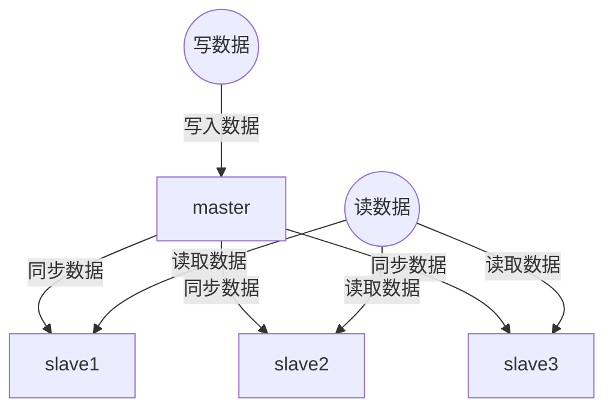
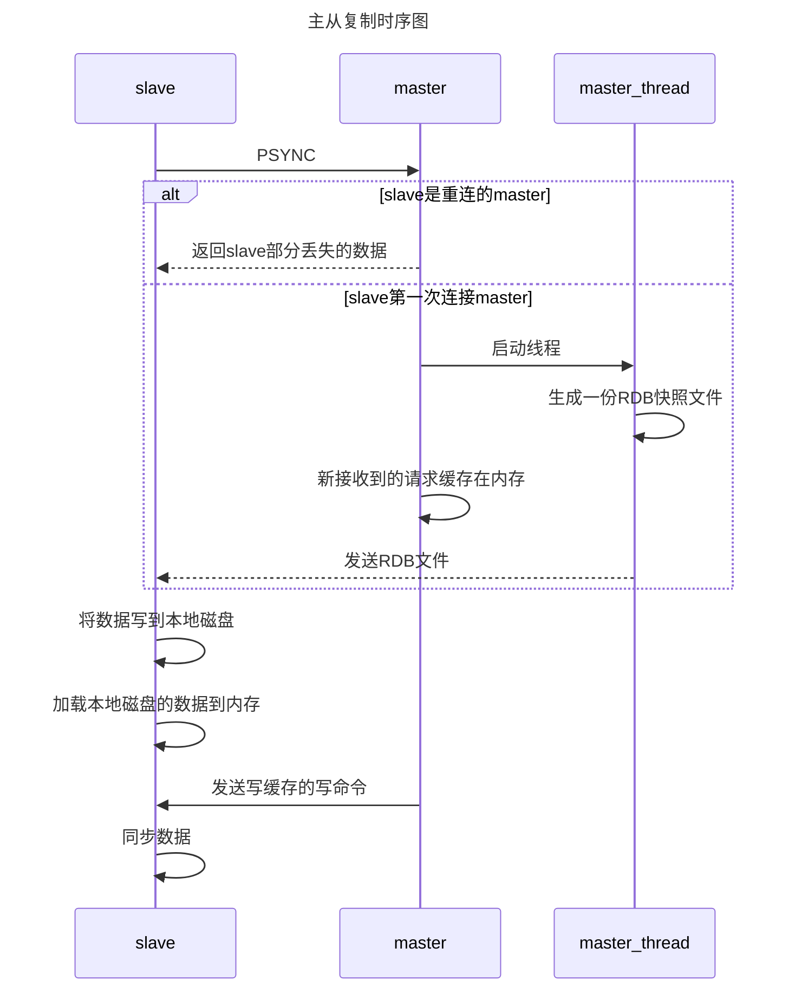

# Redis高并发/高可用

## 主要概念

高并发: 主从架构, 单主写入数据, 多从读取数据

高可用: 主从架构, 哨兵机制

## 高并发

对于缓存而言, 读的概率是要比写的概率大很多的. 显然, 解决高并发的关键点在于读数据.因此, 提出了读写分离的技术.对redis而言, 主要采用的架构是主从架构, 主节点用于处理写入请求, 而若干个从节点用于支持读取请求. 同时, 为了保证读取数据的有效性, 从节点必须和主节点同步数据. 

基本架构如下:

### Redis replication 以及master持久化对主从架构的安全意义

#### Redis replication原理

一个master连接若干个slave节点, 写操作将数据写到master节点上面, 然后在写完之后, 通过异步操作的方式将数据同步到所有slave节点中. 从而, 保证所有节点的数据是一致的.

#### redis replication 核心机制

1. master可以配置多个slave node.同时, slave node也可以连接其他的slave node.
2. 做复制操作的时候, 是不会阻塞master node的
3. slave node在做复制的时候, 不会阻塞自己的操作, 它会使用旧的数据来提供服务; 单复制完成之后, 需要删除旧的数据, 加载新的数据, 这个时候会对外暂停提供服务.

#### master的持久化

对于主从模式而言, 我们需要开启master node的持久化. 同时, 不建议使用slave node作为master node 的热备份. 主要是因为: 如果master宕机, 那么master的数据将会丢失, 重启之后数据是空的, 其他的slave node要是来复制的话, 就会复制到空, 这样所有节点的数据就丢了. 因此, 需要对备份文件做多种冷备份, 防止整个机子坏了.

### 主从复制

#### 数据结构

##### 1.offset

`matser`和`slave`都会维护一个`offset`. `master`会不断累加, `slave`也会不断累加. `slave`需要定时上报自己的`offset`给`master`, `master`也将保存每个`slave`的`offset`. 数据的不一致主要是通过检测`master`的`offset`和`slave`的`offset`

##### 2.backlog

`master`有一个`backlog`在内存中. 当`master`复制数据给`slave`时, 数据也将在`backlog`中同步一份

##### 3. master run id

`slave`通过`master run id`来定位唯一的`master`

#### 原理

##### 准备阶段

1. 当slave node启动时, `slave`会从`redis.conf`中读取到`master`的`host`和`ip`
2. `slave node`内部有一个定时任务, 检查是否有新的`master node`要连接, 如果发现, 就跟`master node`建立socket网络连接
3. `slave`使用ping探测`master`的存在, 如果`master`设置了`requirepass`, 那么`slave`必须发送`master auth`口令进行口令验证.
4. 当启动一个`slave node`的时候, 它会发送一个`PSYNC`命令给`master node`
5. 如果这个`slave node`是重新连接`master node`, 那么 `master node`仅仅会复制给slave部分缺失数据; 如果第一次连接`master node`, 那么将会触发一次`full resynchronization`

##### 增量复制

在全量复制过程中, 如果发生网络失联, 则将会触发增量复制

1. `master`根据`slave`的发送过来的`offset`. 通过对比自己的`offset`和`slave`的`offset`, 找出需要发送的数据.
2. `maste`从自己的`backlog`中获取丢失的数据 , 发送给`slave node`

##### 全量复制

`master`如果发现有多个`slave node`来重新连接, 那么他 仅仅会启动一个`rdb save`操作, 用一份数据服务所有的`slave node`

1. `master`会启动一个后台线程, 开始生成一份`RDB快照文件`. 同时, 还会将客户端新接收到的所有写命令缓存到内存中. (可以通过`repl-timeout`来调整复制时间)
2. `master node `将生成的`RDB`文件发送给`slave node`, `slave`先将其写入磁盘, 然后再从磁盘加载到内存当中. 在复制的过程中, `slave`将会基于旧数据对外进行服务. 
3. `master`会将内存中的写命令发送给`slave node`, `slave node`也会同步这一份数据.

原理时序图如下所示:

#### 断点续传

在主从复制的过程中,如果网络突然断开, 那么可以接着上一次复制的地方继续复制, 而不是从头复制.

##### 原理

master node会在内存中创建一个backlog, 每一个slave都会保存一个offset到backlog中. 如果master和slave的连接中断, slave会让master从上一次的replica offset开始继续复制; 如果没有找到offset, 则会触发一次`full resynchronization`

#### 无磁盘化复制

master直接在内存中创建rdb文件,发送给slave, 不会再本地磁盘中保存数据.

##### 设置方式

`repl-diskless-sync`:该参数保证进行无磁盘化复制

`repl-diskless-sync-delay`: 该参数表示等待一定时长再开始复制, 这样可以等待多个slave节点重新连接上来.

#### 过期key处理

`slave`不会过期`key`, 只有等待`maste`过期`key`

如果master中过期了一个key, 或是淘汰了一个key, 那么`master`将会模拟`发送一条del命令`给slave, slave接到后会删除该key.

##高可用

### 基本原理

保证每个redis都有备份, 当某个redis发生故障时, 可用很快地切换到备份redis上面去.

### 哨兵机制

1. 分布式: 哨兵需要作为一个集群去运行, 各个哨兵需要协同工作
2. 判断`master`宕机, 需要获取大部分哨兵的同意(因此哨兵数应为奇数)
3. 哨兵+redis主从结构是无法保证数据零丢失的, 只会保证redis集群高可用. 同时, 需要做重复的测试和演练

#### sdown和odown

sdown是主观宕机: 某个哨兵觉得master宕机了, 那就是主观宕机. 在redis中, 主要是通过设置`is-master-down-after-milliseconds`, 如果哨兵ping一个`master`, 超过这么多时间没收到回答, 那就认为 `master`已经宕机.

odown是客观宕机: 大多数哨兵觉得宕机了(超过一半以上的哨兵), 那就是客观宕机