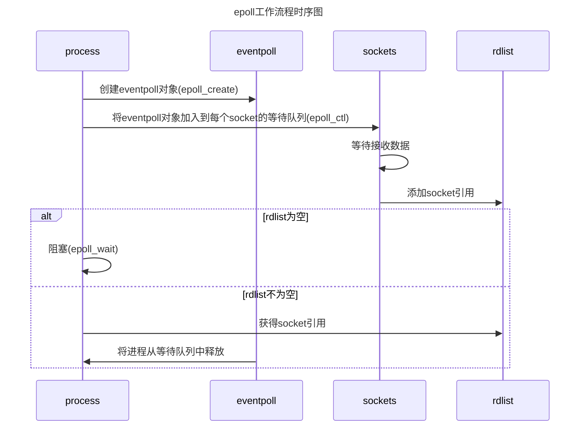

# Epoll本质分析

## 网络数据的传输过程

首先, 网卡收到网线传来的数据, 然后通过硬件的传输将数据写到内存中. 当网卡把数据写到内存之后,网卡向cpu发送一个终端信号,操作系统便知道有新数据的到来,再通过网卡中断程序去处理数据. 中断程序主要执行两个功能: 1. 将网络数据写到对应的socket的接受缓存区中, 2. 唤醒进程A并将进程A放入到工作队列中.

##阻塞的基本原理

当程序执行到recv方法的时候,操作系统会将进程A从工作队列移动到socket等待队列中. 当socket接受到数据后, 操作系统将该socket上的进程重新放回到工作队列中,该线程变成了运行状态,继续执行代码. 同时, 由于socket的接收缓冲区已经有了数据, `recv`可以返回接收到的数据.

##Select实现原理

根据以上分析, 我们不难得知: 服务端需要管理多个客户端连接, 但是一个`recv`只能监视单个`socket`.

###select的设计思想

首先得到一个socket列表, 如果列表中的socket没有数据, 那么就将这个线程加入到等待队列(挂起线程),直到有一个socket接受到数据,然后唤醒线程.

大致实现代码如下:

```c
int s = socket(AF_INET, SOCK_STREAM, 0)l
bind(s, ...);
listen(s, ...);
int fds[] = 需要监听的sockets
while(true){
	int n = select(..., fds, ...);
	for(int i=0; i<fds.count; i++){
		if(FD_ISSET(fds[i], ...)){
			//fds[i]处理数据
		}
	}
}
```

从上面代码,我们可以看出: 首先,我们需要获取一个fds数组,用于表示需要维护的sock(在这里, 我们已经将`socket`与`fd`绑定了). 然后, 调用select, 如果fds中的所有sockets没有数据, select将会阻塞, 直到有一个socket接收到数据, select才会返回,唤醒线程. 用户可以遍历fds, 通过FD_ISSET判断具体是哪个socket接受到了数据,然后进行相应的处理.

尽管这个方法简单并且有效,但是还是存在诸多缺点:

1. 当进程的fds被写入数据后, 进程根本不知道是哪个socket被写入了数据, 因此需要遍历一次来查询. 在高并发的场景下, 这将会浪费很多时间.
2. 每次调用select都需要将进程加入到所有监视的socket的等待队列中, 每次唤醒时需要从每个队列中移除. 这里涉及到两次遍历, 每次都要将整个fds列表传入到内核, 有一定的开销.

##Epoll对于select的改进

在linux内核2.6以后, 加入了epoll.

epoll的调用代码大致如下:

```C
int s = socket(AF_INET, SOCK_STREAM, 0);
bind(s,...);
listen(s, ...);

int epfd = epoll_create(...);
//将所有需要监听的socket添加到epfd中
epoll_ctl(epfd, ...);

while(true){
  //*
	int n = epoll_wait(...);
	for(接收到数据的socket){
		//处理
	}
}
```

根据上面的代码我们可以发现几点不同:

1. 功能分离

   对于*所在的代码行, 我们可以发现如下的区别:

   `select`模式的实现:

   在`select`模式中, `select`方法的语义是: 查询所有的`socket`, 如果`socket`没有数据, 则会将`select`阻塞, 直到这些`socket`中有数据写入, 才会将数据返回, 从而唤醒进程.

   `epoll`模式的实现:

   首先, `epoll_wait()`的语义是: 获取`rdlist`的`socket`. 在这里没有轮询的操作. 在这里实现`阻塞`和`维护监视队列`分离的原理是: 用红黑树来维护一个保存监视`socket`, 因为需要`add`, `delete 和`search. 选用了复杂度均为`nlog(n)`的数据结构, 作为`socket`的索引

2. 就绪列表

   `select`模式的实现:

   由于, `select`的进程并不知道哪个`socket`被写入数据了. 因此, 进程又要对fds进行轮询, 并通过`FD_ISSET(fds[i], ...)`比对, 来判断是哪个`socket`被写入了.

   `epoll`模式的实现:

   `epoll`则通过`rdlist`, 直接将`socket`对应的引用返回给客户端.

##Epoll工作流程和具体实现

###1. 创建epoll对象

当客户端调用`epoll_create`方法时, 内核会创建一个`eventpoll`对象. 这个对象与`socket`并没有太大的差距, 他是文件系统的一员, 同样他也会有等待队列.

###2. 维护监视列表

创建epoll对象之后, 我们用`epoll_ctl()`来添加/删除要监听的socket. 也就是说, 内核会将`epoll`对象添加/删除到socket的等待队列中. 当socket收到数据之后, 中断程序会操作`eventpoll`对象, 而不是直接操作进程.

###3. 接收数据

当socket接收到数据之后, 中断程序会给`eventpoll`的就绪列表(aka, `rdlist`) 添加socket引用. 此外, 中断程序还会唤醒`eventpoll`等待队列中的进程.

根据以上叙述, `epoll_wait`的语义是:首先, 将调用`epoll_wai()`的进程加入到`eventpoll`的等待队列中; 如果rdlist已经引用了socket, 那么`epoll_wait`则返回, 并唤醒等待队列中的进程; 如果`rdlist`为空, 则阻塞进程. 

具体实现流程如下图所示:



## Epoll数据结构实现

epoll有两个主要的数据结构:`rdr`(红黑树, 用于保存socket的fd)和`存储队列`(双向链表, rdlist)

## 小结

`epoll`主要是对于`select`和`poll`进行优化, 加入了`eventpoll`作为中间层, 并使用了`红黑树`和`双向链表`这样的数据结构. 从而, 实现了高效的多路复用技术.